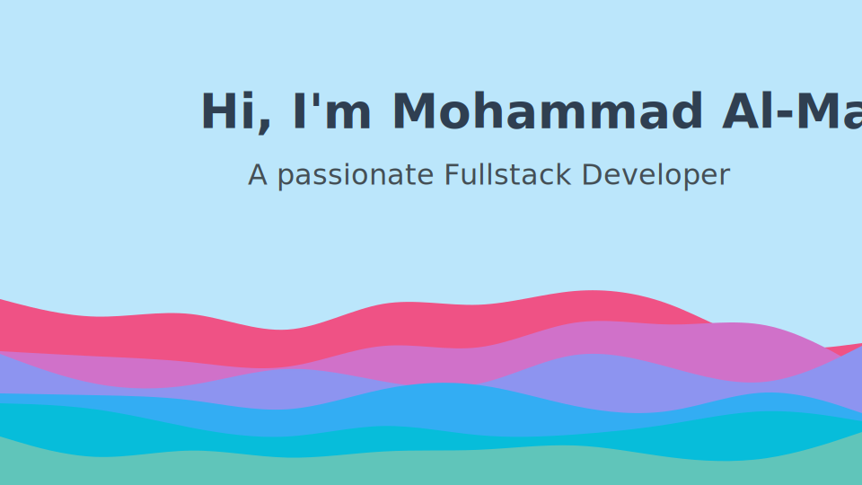

# ⚒️ Skills

### 🏎️ Programming Languages

### 🌋 Frontend Development

### 🔥 Backend Development

### 📦 Database

 

## 🤙 Connect with me

[][linkedin]
[][github]
[][email]

---

<!-- 

 -->

[linkedin]: https://www.linkedin.com/in/mohammadmajali/
[github]: https://github.com/mukul98s?tab=follow
[email]: mohammad.a.majaly@gmail.com